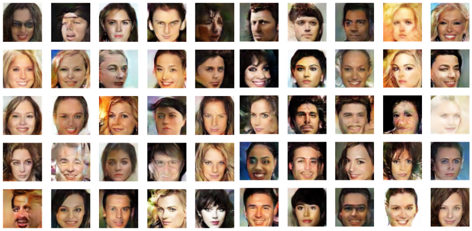
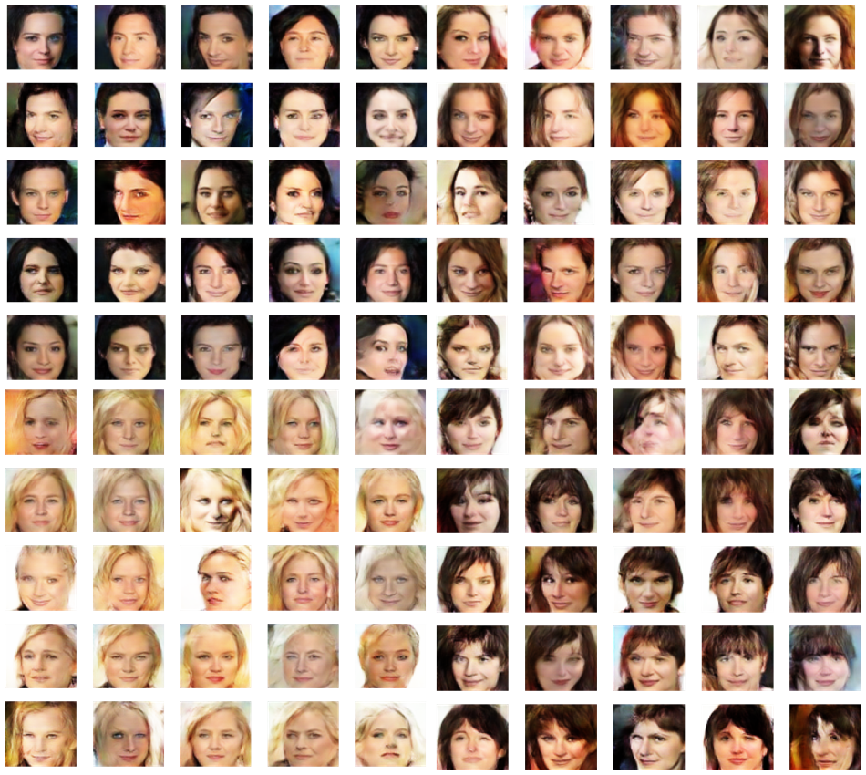
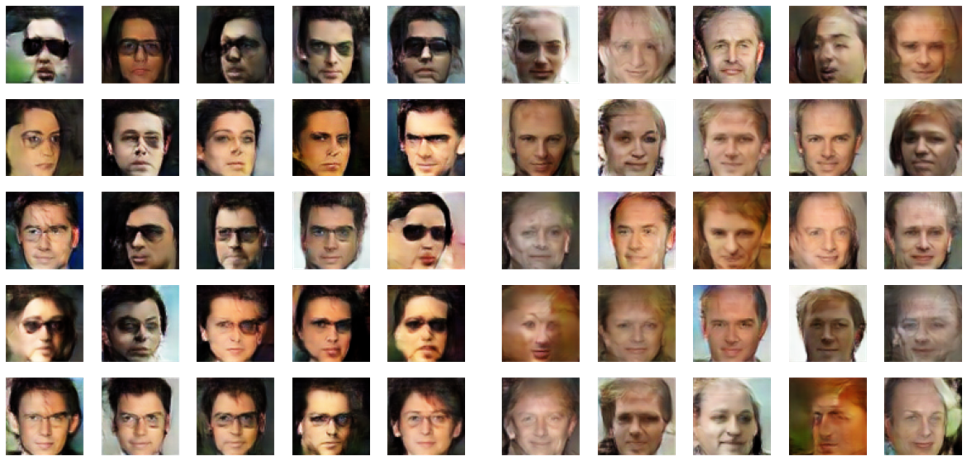

# CelebA-Conditional-GAN

## Getting Started

1. Download the datatest zip file (img_align_celeba.zip) and the attribute file (list_attr_celeba.txt) from http://mmlab.ie.cuhk.edu.hk/projects/CelebA.html
2. Create a folder in your Google Drive where upload the downloaded files
3. Open the VAC+GAN notebook and enjoy!

If you do not want to download the datatest zip file and the attribute file you can use the VAC+GAN+tfrec notebook. Doing so the dataset is loaded from a Google Cloud bucket. Please notice that if you want to load the datatest from tfrecords after April 2021 you have to use the celeba_tfrec script (`celeba_tfrec.py --fn_root PathWhereYourZipFileIsStored --partition_fn PathWhereYouWantToSaveTheTfrecs --number NumberOfTfrecs`) to create your own tfrec files and upload them on a Google Cloud bucket that you prefer, then you just have to modify a little bit the notebook code by changing the path of the bucket.

## Network

  

In this kind of approach, the Generative Adversarial Network generator is turned into a conditional generator by placing a multi-class classifier in parallel with the discriminator network and backpropagate the classification error through the generator. This technique is versatile enough to be applied to any GAN.

## Results

Images generated from random labels of the dataset

Top-Left: Young = 1, Attractive = 1, Black_Hair  = 1, Smiling = 1, Heavy_Makeup = 1, No_Bread = 1  

Top-Right: Young = 1, Attractive = 1, Brown_Hair  = 1, Smiling = 1, Heavy_Makeup = 1, No_Bread = 1

Bottom-Left: Young = 1, Attractive = 1, Blond_Hair  = 1, Smiling = 1, Heavy_Makeup = 1, No_Bread = 1 

Bottom-Right: Young = 1, Attractive = 1, Brown_Hair  = 1, Smiling = 1, Heavy_Makeup = 1, No_Bread = 1, Bans = 1

Left: Male = 1, Young = 1, Attractive = 1, Black_Hair  = 1, Eyeglasses = 1, No_Bread = 1 

Right: Male = 1, Attractive = 1, Bald = 1, Big_Nose = 1, No_Bread = 1

## Authors

**Simone Gayed Said** - simone.gayed@studio.unibo.it  
**Pierpasquale Colagrande** - pierpasquale.colagrande@studio.unibo.it  

## References
- Ilya Kavalerov, Wojciech Czaja, Rama Chellappa. cGANs with Multi-Hinge Loss. 	arXiv:1912.04216 [cs.LG],], Dec. 2019

- Yan Wu, Jeff Donahue, David Balduzzi, Karen Simonyan, Timothy Lillicrap. LOGAN: Latent Optimisation for Generative Adversarial Networks. arXiv:1912.00953 [cs.LG], Dec 2019

- Yang Zhao, Chunyuan Li, Ping Yu, Jianfeng Gao, Changyou Chen. Feature Quantization Improves GAN Training. arXiv:2004.02088 [cs.LG], Apr 2020

- Sophie Searcy, https://soph.info/odsc2019, May 2019

- Shabab Bazrafkan, Peter Corcoran. Versatile Auxiliary Classifier with Generative Adversarial Network (VAC+GAN), Multi Class Scenarios. arXiv:1806.07751 [cs.LG], Jun 2018

- Martin Heusel, Hubert Ramsauer, Thomas Unterthiner, Bernhard Nessler, Sepp Hochreiter. GANs Trained by a Two Time-Scale Update Rule Converge to a Local Nash Equilibrium.  arXiv:1706.08500 [cs.LG], Jun 2017

- Takeru Miyato, Toshiki Kataoka, Masanori Koyama, Yuichi Yoshida. Spectral Normalization for Generative Adversarial Networks.  arXiv:1802.05957 [cs.LG], Feb 2018

- Martin Heusel, Hubert Ramsauer, Thomas Unterthiner, Bernhard Nessler, Sepp Hochreiter. GANs Trained by a Two Time-Scale Update Rule Converge to a Local Nash Equilibrium.  arXiv:1706.08500 [cs.LG], Jun 2017

- Yaniv Benny, Tomer Galanti, Sagie Benaim, Lior Wolf. Evaluation Metrics for	Conditional Image Generation. arXiv:2004.12361, Apr 2020

